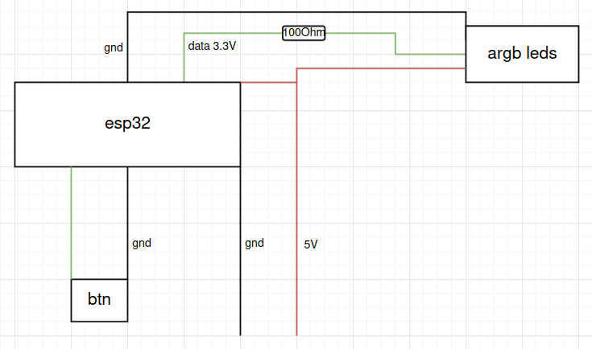

## ESP32ARGB
My attempt to DIY ARGB effects suited my needs with spare ESP32.

## Modes
- Off
- Flickering
- Color chase
- Rainbow
- Rainbow chase

## Simplified schematic of current build

## Todo
- More data lines
- Proper 5V for data (level shifter?)
- More modes
